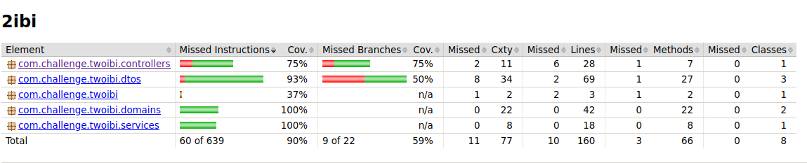

# 2IBI Challenge
#### Database migration : ```Flyway```
#### Multi environment setup
```java
application.properties
applications-dev.properties //development configurarion
appplication-prod.properties // production configuratio
```
#### Relational database : 
```java
Development : H2
Production : Postgresql
```
#### Cobertura de testes
```xml
Jacoco : 90%
<plugin>
<groupId>org.jacoco</groupId>
<artifactId>jacoco-maven-plugin</artifactId>
<version>0.8.7</version>
<plugin>
```


### 1. Listar todos os paises

#### 1.1 Request
```java
GET /api/v1/country 
        
GET /api/v1/country?sortBy={sortKey} //Listar a os paises e ordenar atrávez do sortKey
    Ex: /api/v1/country?sortBy=region
```

#### 1.2 Response
```json
[
    {
        "id": 2,
        "name": "Country 1",
        "capital": "capital 1",
        "region": "Region 1",
        "subRegion": "Sub region 1",
        "area": "30,000 m2"
    },
    {
        "id": 3,
        "name": "Country 2",
        "capital": "capital 2",
        "region": "Region 2",
        "subRegion": "Sub region 2",
        "area": "50,000 m2"
    }
]
```

### 2. Listar dados de um determinado pais

#### 2.1 Request
```java
GET /api/v1/country/{id}
    Ex:/api/v1/contry/2
```

#### 2.2 Response
```json
{
    "id": 2,
    "name": "Country 1",
    "capital": "capital 1",
    "region": "Region 1",
    "subRegion": "Sub region 1",
    "area": "30,000 m2"
}
```

### 3. Delete country

#### 3.1 Request
```java
DELETE /api/v1/country/{id}
```

#### 3.2 Response
```json
status 200
```

### 4. Criar um novo pais

#### 4.1 Request
```json
POST /api/v1/country
```
##### 4.1.2 Request Body
```json
{
    "name": "Country 2",
    "capital": "capital 2",
    "region": "Region 2",
    "subRegion": "Sub region 2",
    "area": "50,000 m2"
}
```

#### 4.2 Response
```json
{
    "id": 4,
    "name": "Country 2",
    "capital": "capital 2",
    "region": "Region 2",
    "subRegion": "Sub region 2",
    "area": "10,000 m2"
}
```

### 5. Actualizar um  pais

#### 5.1 Request
```json
PUT /api/v1/country
```
##### 5.1.2 Request Body
```json
{
  "id": 4,
  "name": "Country 2",
  "capital": "capital 2",
  "region": "Region 2",
  "subRegion": "Sub region 2",
  "area": "700,000 m2"
}
```

#### 5.2 Response
```json
{
    "id": 4,
    "name": "Country 2",
    "capital": "capital 2",
    "region": "Region 2",
    "subRegion": "Sub region 2",
    "area": "700,000 m2"
}
```

